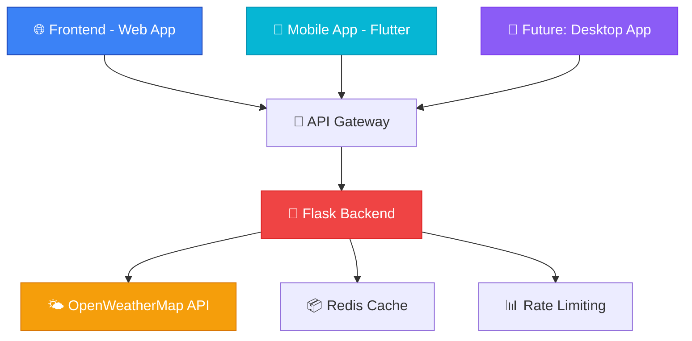

## README.md

<div align="center">
  
# 🌤️ Weatherly

### Beautiful Weather Forecasts Everywhere

*A modern, cross-platform weather application delivering stunning visuals and accurate forecasts*

[](https://weatherly-appnow.vercel.app/)
[](https://drive.google.com/uc?export=download&id=10lPOkrf2HACA6ht-cirq_ubcW6adB_W2
)
[](https://weatherly-app-bp4c.onrender.com/)


<br>


</div>

---

## ✨ Features

<table>
<tr>
<td width="50%">

### 🎨 **Beautiful Design**
- **Glassmorphism UI** with stunning visual effects
- **Dynamic themes** that adapt to weather and time
- **Immersive animations** for weather conditions
- **Responsive design** across all devices

### 📊 **Comprehensive Data**
- **Real-time weather** with automatic updates
- **7-day forecasts** with detailed information
- **Hourly predictions** for precise planning
- **Multiple metrics** (humidity, pressure, wind, UV)

</td>
<td width="50%">

### 🚀 **Advanced Features**
- **Location services** with GPS support
- **Search functionality** for worldwide cities
- **Saved locations** for quick access
- **Offline support** with cached data

### 🔧 **Developer Ready**
- **RESTful API** for easy integration
- **Modern tech stack** with best practices
- **Comprehensive documentation**
- **Error handling** and fallback systems

</td>
</tr>
</table>

---

## 🏗️ Architecture

<div align="center">



</div>

### 🏛️ **Project Structure**

```
/weatherly
├── 🔧 Backend/           # Flask API Server
│   ├── app.py           # Main application
│   ├── requirements.txt # Dependencies
│   └── config/          # Configuration files
├── 🌐 Frontend/         # Web Application
│   ├── index.html       # Main page
│   ├── about.html       # About page
│   ├── css/            # Stylesheets
│   └── js/             # JavaScript modules
└── 📱 APP/             # Flutter Mobile App
    ├── lib/            # Dart source code
    ├── assets/         # Images and resources
    └── pubspec.yaml    # Dependencies
```

---

## 🚀 Quick Start

### 🌐 **Try It Now**

<div align="center">

| Platform | Access Method | Status |
|----------|---------------|--------|
| **🌐 Web** | [weatherly-appnow.vercel.app](https://weatherly-appnow.vercel.app/) | ✅ Live |
| **📱 Android** | [Download APK](https://drive.google.com/uc?export=download&id=10lPOkrf2HACA6ht-cirq_ubcW6adB_W2
) | ✅ Available |
| **🍎 iOS** | Coming Soon | 🔄 In Development |
| **🖥️ Desktop** | Coming Soon | 🔄 Planned |

</div>

### 🔧 **Local Development**

<details>
<summary><b>🐍 Backend Setup</b></summary>

```bash
# Navigate to backend directory
cd Backend

# Create virtual environment
python -m venv venv
source venv/bin/activate  # Windows: venv\Scripts\activate

# Install dependencies
pip install -r requirements.txt

# Set environment variables
export WEATHER_API_KEY="your_openweathermap_api_key"
export FLASK_ENV="development"

# Run the server
python app.py
```

**Environment Variables Required:**
```env
WEATHER_API_KEY=your_openweathermap_api_key
FLASK_ENV=development
REDIS_URL=redis://localhost:6379
SECRET_KEY=your_secret_key
```

</details>

<details>
<summary><b>🌐 Frontend Setup</b></summary>

```bash
# Navigate to frontend directory
cd Frontend

# Serve with any HTTP server
# Option 1: Python
python -m http.server 8000

# Option 2: Node.js
npx serve .

# Option 3: Live Server (VS Code Extension)
# Right-click index.html -> "Open with Live Server"
```

**Features:**
- 🎨 Glassmorphism design with backdrop filters
- 🌈 Dynamic theming based on weather conditions
- 📱 Fully responsive across all devices
- ⚡ Progressive Web App (PWA) support

</details>

<details>
<summary><b>📱 Mobile App Setup</b></summary>

```bash
# Navigate to app directory
cd APP

# Install Flutter dependencies
flutter pub get

# Run on connected device/emulator
flutter run

# Build APK
flutter build apk --release

# Build for iOS (macOS only)
flutter build ios --release
```

**Requirements:**
- Flutter SDK 3.0+
- Dart 3.0+
- Android Studio / Xcode
- Connected device or emulator

</details>

---

## 🛠️ Tech Stack

<div align="center">

### **Backend**


### **Frontend** 


### **Mobile**


### **Deployment**


</div>

---

## 📸 Screenshots

<div align="center">

### 🌐 **Web Application**

<table>
<tr>
<td align="center" width="33%">

<br><sub><b>Home Screen</b></sub>
</td>
<td align="center" width="33%">

<br><sub><b>Search Interface</b></sub>
</td>
<td align="center" width="33%">

<br><sub><b>About Page</b></sub>
</td>
</tr>
</table>

### 📱 **Mobile Application**

<table>
<tr>
<td align="center" width="25%">

<br><sub><b>Splash Screen</b></sub>
</td>
<td align="center" width="25%">

<br><sub><b>Weather Dashboard</b></sub>
</td>
<td align="center" width="25%">

<br><sub><b>Location Search</b></sub>
</td>
<td align="center" width="25%">

<br><sub><b>Settings Panel</b></sub>
</td>
</tr>
</table>

</div>

---

## 🔗 API Documentation

<details>
<summary><b>📋 Available Endpoints</b></summary>

### **Weather Endpoints**

#### Get Current Weather by City
```http
GET /api/v1/weather/{city}
```

**Response:**
```json
{
  "success": true,
  "data": {
    "city": "London",
    "country": "GB",
    "temperature": {
      "current": 22,
      "feels_like": 24,
      "min": 18,
      "max": 26
    },
    "weather": {
      "main": "Clear",
      "description": "Clear sky",
      "icon": "01d"
    },
    "details": {
      "humidity": 65,
      "pressure": 1013,
      "wind_speed": 3.5,
      "visibility": 10
    }
  }
}
```

#### Get Weather by Coordinates
```http
GET /api/v1/weather/coordinates?lat={lat}&lon={lon}
```

#### Get 5-Day Forecast
```http
GET /api/v1/forecast/{city}
```

#### Bulk Weather Data
```http
POST /api/v1/weather/bulk
Content-Type: application/json

{
  "cities": ["London", "Paris", "Tokyo"]
}
```

### **Rate Limits**
- Weather endpoints: 30 requests/minute
- Forecast endpoints: 20 requests/minute  
- Bulk endpoints: 10 requests/minute

</details>

---

## 🤝 Contributing

We welcome contributions! Here's how you can help:

<div align="center">

[](#)
[](#)
[](#)

</div>

### **Development Workflow**

1. **🍴 Fork** the repository
2. **🔀 Create** a feature branch
   ```bash
   git checkout -b feature/amazing-feature
   ```
3. **💻 Make** your changes
4. **✅ Test** your implementation
5. **📝 Commit** your changes
   ```bash
   git commit -m "Add amazing feature"
   ```
6. **🚀 Push** to your branch
   ```bash
   git push origin feature/amazing-feature
   ```
7. **📥 Open** a Pull Request

### **Contribution Areas**

- 🐛 **Bug fixes** and issue resolution
- ✨ **New features** and enhancements
- 📚 **Documentation** improvements
- 🎨 **UI/UX** design improvements
- 🧪 **Testing** and quality assurance
- 🌍 **Internationalization** and localization

---

## 📄 License

<div align="center">

**MIT License** © 2025 Srinath Nulidonda

*Permission is hereby granted, free of charge, to any person obtaining a copy of this software...*

[](LICENSE)

</div>

---

## 👨‍💻 Author

<div align="center">

### **Srinath Nulidonda**
*Full-Stack Developer & Mobile App Developer*

[](https://srinathnulidonda.vercel.app/)
[](https://github.com/Srinathnulidonda)
[](mailto:srinathnulidonda.dev@gmail.com)

*Passionate about creating beautiful, functional applications that solve real-world problems.*

</div>

---

## 🙏 Acknowledgments

<div align="center">

**Special Thanks To:**

[](https://openweathermap.org/)
[](https://fontawesome.com/)
[](https://vercel.com/)
[](https://render.com/)

</div>

---

<div align="center">

### 🌟 **Star this project if you found it helpful!**

[](https://github.com/srinathnulidonda/weatherly/stargazers)
[](https://github.com/srinathnulidonda/weatherly/network/members)
[](https://github.com/srinathnulidonda/weatherly/watchers)

---

*Built with ❤️ and ☕ by SN*

**[⬆ Back to Top](#-weatherly)**

</div>