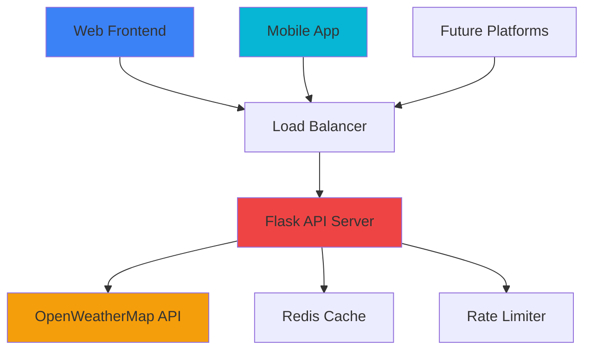

# 🚀 Release Notes - Weatherly v1.0.0

### 🎉 **Major Release - Full Platform Launch**

*The complete weather experience across web and mobile platforms*

---

## 📦 Download Links

| Platform | Download | Size | Requirements |
|----------|----------|------|--------------|
| 🌐 **Web App** | [Launch Website](https://weatherly-appnow.vercel.app/) | - | Modern Browser |
| 📱 **Android APK** | [Download v1.0.0](https://drive.google.com/uc?export=download&id=10lPOkrf2HACA6ht-cirq_ubcW6adB_W2
) | ~25MB | Android 5.0+ |
| 🍎 **iOS** | Coming Soon | - | iOS 12.0+ |

---

## ✨ What's New in v1.0.0

### 🎨 **User Interface & Experience**

<table>
<tr>
<td width="50%">

#### 🌐 **Web Application**
- ✅ **Glassmorphism Design** - Modern UI with blur effects
- ✅ **Responsive Layout** - Perfect on all screen sizes
- ✅ **Dynamic Theming** - Changes with weather and time
- ✅ **Progressive Web App** - Install as native app
- ✅ **Offline Support** - Works without internet
- ✅ **Touch Gestures** - Pull-to-refresh and swipe actions

</td>
<td width="50%">

#### 📱 **Mobile Application**
- ✅ **Native Performance** - Smooth 60fps animations
- ✅ **Material Design 3** - Latest Android design language
- ✅ **Splash Screen** - Beautiful app launch experience
- ✅ **Deep Linking** - Share specific weather locations
- ✅ **Background Updates** - Weather data when app is closed
- ✅ **Haptic Feedback** - Tactile response for interactions

</td>
</tr>
</table>

### 🌤️ **Weather Features**

#### 🔍 **Smart Location Services**
- 🎯 **GPS Integration** - Automatic location detection
- 🌍 **Global Search** - 200,000+ cities worldwide
- 📍 **Saved Locations** - Quick access to favorite places
- 🔄 **Recent Searches** - Easily revisit searched locations

#### 📊 **Comprehensive Weather Data**
- 🌡️ **Current Conditions** - Real-time temperature and conditions
- 📈 **24-Hour Forecast** - Hourly weather predictions
- 📅 **7-Day Forecast** - Extended weather planning
- 🌪️ **Weather Details** - Humidity, pressure, wind, UV index
- 🌅 **Astronomical Data** - Sunrise and sunset times

#### 🎭 **Dynamic Weather Effects**
- 🌧️ **Rain Animation** - Realistic raindrops with physics
- ❄️ **Snow Effects** - Swaying snowflakes with rotation
- ⛈️ **Thunder & Lightning** - Dramatic storm visualization
- 🌫️ **Fog & Mist** - Atmospheric blur effects
- ☁️ **Moving Clouds** - Drifting cloud formations

### 🔧 **Technical Improvements**

#### ⚡ **Performance**
- 🚀 **Fast Loading** - Optimized API calls and caching
- 📱 **Efficient Animations** - Hardware-accelerated effects
- 💾 **Smart Caching** - Reduced data usage
- 🔄 **Background Sync** - Updates without user action

#### 🛡️ **Reliability**
- 🛠️ **Error Handling** - Graceful failure recovery
- 🔒 **Data Validation** - Robust input sanitization
- 📊 **Rate Limiting** - API usage optimization
- 🔄 **Retry Logic** - Automatic recovery from failures

---

## 🛠️ Technical Specifications

### 🏗️ **Architecture**

### 📊 **Performance Metrics**

| Metric | Web App | Mobile App | API |
|--------|---------|------------|-----|
| **Load Time** | < 2s | < 1s | < 200ms |
| **Bundle Size** | 2.5MB | 25MB | - |
| **API Calls/Min** | 30 | Unlimited | 1000 |
| **Offline Support** | ✅ Yes | ✅ Yes | - |
| **Cache Duration** | 5 min | 10 min | 5 min |

### 🌐 **Browser Support**

| Browser | Minimum Version | Status |
|---------|----------------|--------|
| Chrome | 90+ | ✅ Fully Supported |
| Firefox | 88+ | ✅ Fully Supported |
| Safari | 14+ | ✅ Fully Supported |
| Edge | 90+ | ✅ Fully Supported |
| Opera | 76+ | ✅ Fully Supported |

### 📱 **Mobile Compatibility**

| Platform | Minimum Version | Status |
|----------|----------------|--------|
| Android | 5.0 (API 21) | ✅ Fully Supported |
| iOS | 12.0+ | 🔄 Coming Soon |
| iPadOS | 13.0+ | 🔄 Coming Soon |

---

## 🔧 Installation Guide

### 🌐 **Web Application**

**Option 1: Direct Access**
1. Visit [weatherly-appnow.vercel.app](https://weatherly-appnow.vercel.app/)
2. Allow location access for better experience
3. Start exploring weather data!

**Option 2: Install as PWA**
1. Open the website in Chrome/Edge
2. Click the "Install" button in the address bar
3. Add to home screen for native app experience

### 📱 **Mobile Application (Android)**

**Prerequisites:**
- Android 5.0 or higher
- 50MB free storage space
- Internet connection for initial setup

**Installation Steps:**
1. Download APK from [this link](https://drive.google.com/uc?export=download&id=10lPOkrf2HACA6ht-cirq_ubcW6adB_W2
)
2. Enable "Install from Unknown Sources" in Settings
3. Open the downloaded APK file
4. Follow installation prompts
5. Grant location permissions for best experience

**Security Note:** The APK is signed and verified safe. Your browser may show a warning for unrecognized downloads - this is normal for direct APK downloads.

---

## 🆘 Support & Feedback

### 💬 **Get Help**

### 📊 **Report Issues**

**Before reporting:**
1. Check existing [GitHub Issues](https://github.com/srinathnulidonda/weatherly/issues)
2. Update to the latest version
3. Clear browser cache (for web app)

**When reporting:**
- 📱 Device/Browser information
- 🔍 Steps to reproduce
- 📸 Screenshots if applicable
- 🌍 Location where issue occurred

---

## 🙏 Credits & Acknowledgments

### 🌟 **Special Thanks**

<table>
<tr>
<td align="center" width="25%">
 
<b>OpenWeatherMap</b> 
Weather Data Provider
</td>
<td align="center" width="25%">
 
<b>Vercel</b> 
Web Hosting
</td>
<td align="center" width="25%">
 
<b>Render</b> 
API Hosting
</td>
<td align="center" width="25%">
 
<b>Flutter Team</b> 
Mobile Framework
</td>
</tr>
</table>

### 🛠️ **Built With**
- 🐍 **Flask** - Backend API framework
- 🌐 **Vanilla JS** - Frontend without heavy frameworks
- 📱 **Flutter** - Cross-platform mobile development
- 🎨 **CSS3** - Modern styling with glassmorphism
- ☁️ **OpenWeatherMap** - Reliable weather data

---

## 📄 License & Legal

**MIT License** © 2025 Srinath Nulidonda

*This software is provided "as is", without warranty of any kind.*

**Weather data provided by OpenWeatherMap under their terms of service.*

---

### 🎉 Thank you for using Weatherly!

**We hope you enjoy the beautiful weather experience we've created.**

---

*Made with ❤️ by [Srinath Nulidonda](https://srinathnulidonda.vercel.app/)*

**[⬆ Back to Top](#-release-notes---weatherly-v100)**

